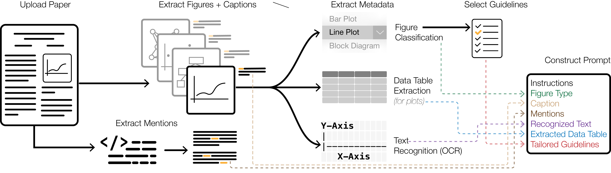

# FigurA11y

## Overview
This repository contains the implementation of **FigurA11y**, a system presented in our IUI 2024 paper. **FigurA11y** assists authors in creating high-quality alt text for scientific figures using a human-AI collaborative approach.

This code is primarily intended for research purposes and may not be suitable for production deployments.

## Table of Contents
1. [System Architecture](#system-architecture)
2. [Prerequisites](#prerequisites)
3. [Getting Started](#getting-started)
4. [Project Structure](#project-structure)
5. [Environment Setup](#environment-setup)
6. [Development and Production Builds](#development-and-production-builds)
7. [API Documentation](#api-documentation)
8. [UI Guide](#ui-guide)
9. [Contributing](#contributing)
10. [License](#license)

## <a name="system-architecture"></a>System Architecture
FigurA11y combines a Flask-based backend and a NextJS frontend. The backend handles PDF processing and metadata extraction, while the frontend provides an interactive interface for alt text editing.



## <a name="prerequisites"></a>Prerequisites
Before following the steps below, make sure that you have the latest version of [Docker 🐳](https://www.docker.com/get-started) installed on your local machine.

For AI suggestions, you will also need an OpenAI API key. Once you have one, place it in `ui/.env`:
```bash
OPENAI_API_KEY="XXXXXXXXXXXXXXXX"
```

You will also need to download the [DocFigure](https://github.com/jobinkv/DocFigure) pretrained checkpoint as `api/models/docfigure.pth`.


## <a name="getting-started"></a>Getting Started
To start a version of the application locally for development purposes after cloning the repository, run:
```bash
~ docker compose up --build
```

#### <a name="development-and-production-builds"></a>Development and Production Builds
By default, the following command makes a development build:
```bash
docker-compose up --build
```

This enables features like live updates, debug logs, etc.

For a production build, instead use:
```bash
docker-compose -f docker-compose.prod.yaml up --build
```

## <a name="project-structure"></a>Project Structure
### Flask Backend API (`/api`)
- `/app`: Main application code.
  - `/models`: Machine learning model wrappers for pipeline preprocessing steps.
  - `/services`: Services defining preprocessing steps to be composed into the pipeline.
  - `/api`: Definition of API endpoints. Structured as a collection of blueprints.
- `/demo`: Other logging dependencies.

### NextJS Frontend UI (`/ui`)
- `/components`: React components for UI building blocks.
  - `/description-editor`: Components for description editor.
- `/context`: React context for global state management (currently used for settings).
- `/hooks`: Custom React hooks for shared logic (mainly used for the Zustand stores)
- `/lib`: Utility functions and classes.
- `/pages`: NextJS pages.
  - `/api`: API routes (used for suggestions, via OpenAI API).
